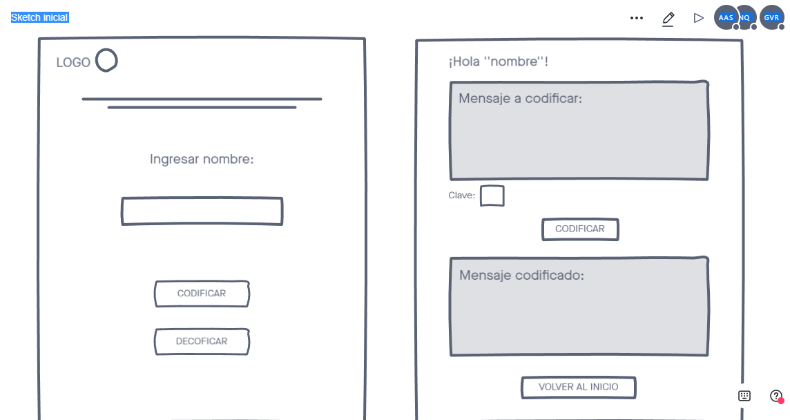
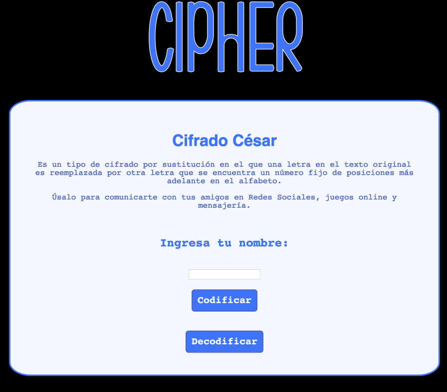
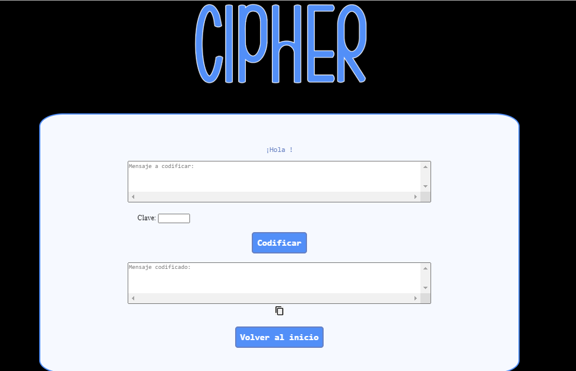

# Cipher 
Te presentamos Cipher, te permite codificar y decodificar un texto usando el famoso cifrado César o cifrado de rotación. Usa una encriptación de sustitución simple, esto significa que cada caracter se sustituye por otro caracter de acuerdo con un sistema específico, según sea la clave elegida e ingresada por el usuario. Te Invitamos a probarla. 

## Contenido 

1. STATUS : RUNNING 
2. README : PENDING 
3. COMMITS : 12
4. TECH  : Javascripts , CSS 

## Historia, contenido y características 

Se desarrolla una herramienta dirigida a adolescentes para ser usado con el fin de comunicarse en un lenguaje exclusivo y privado con sus pares a través de plataformas sociales, juegos en línea o chat. Dada nuestra investigación, no fue posible darle un uso a un público más adulto. 
Se solicita feedback para elegir el diseño más acorde al segmento del grupo y se recoge sugerencias que son aplicadas al diseño el cual fue pensado de una forma simple para cualquier usuario.

 

Cuenta con un registro temporal del nombre que es borrado ya que su uso es privado.
También existe una sección para el ingreso de texto rápido, el cual se codifica y se decofica.

## Instrucciones para Usuarios 

Cuando esta listo para usar, solo se necesita tener un navegador para acceder a nuestra página. Debes comenzar colocando tu nombre. 

 

Después elige que es lo que quieres hacer ¿ CODIFICAR o DECODIFICAR? para ello también debes tener claro quien o quienes serén los recepctores de tu información y acordar con ellos la clave (el nº de rotacion de los caracteres).
Luego accederemos a nuestro espacio para ingresar nuestro texto y colocar la clave acordada. 

 

Puedes copiar tu el texto Codificado o Decodificado para pegarlo después en cualquier pagina, correo electrónico o chat que tu quieras.